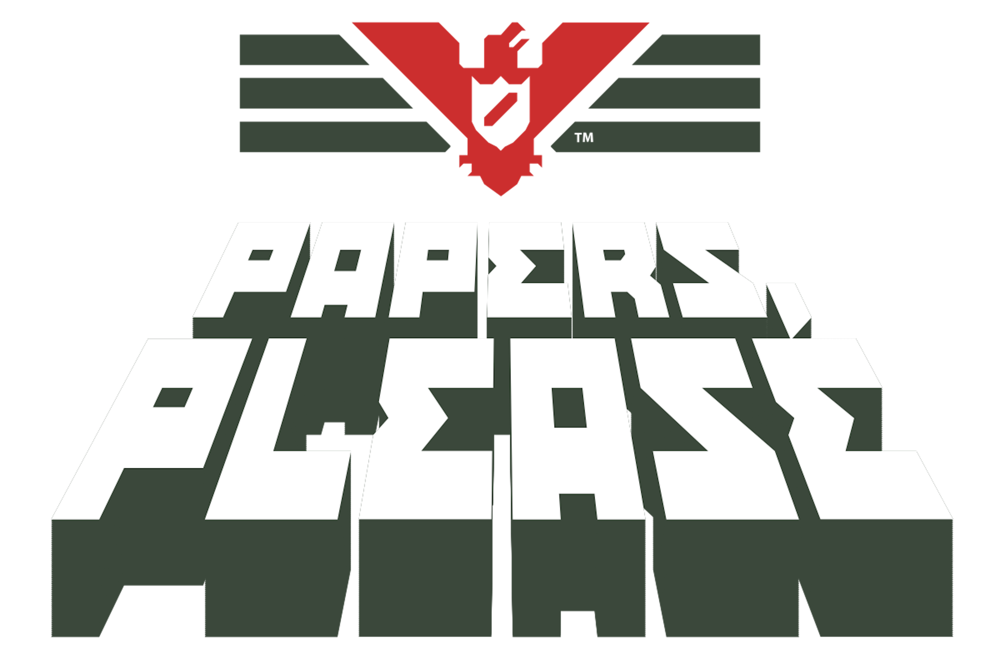
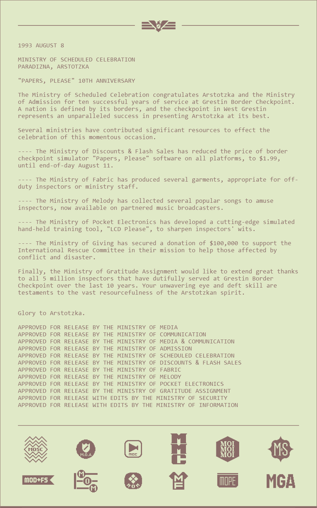

# [Glory Greatest - Press Release Generator](https://glory-greatest.googlyblox.repl.co)

Generate official press releases in the style of "Papers, Please," a game by Lucas Pope. This web application allows you to create, modify, and present press releases like those from the fictional world of Arstotzka.

## Table of Contents

- [Features](#features)
- [Usage](#usage)
- [Credits](#acknowledgements)
- [Example](#examples)

## Features

- **Real-Time Editing**: Modify the content of the press release and see the changes in real-time.
- **Themed Style**: Styled in a way that resembles the in-game documents and interfaces.
- **Customization Options**: Toggle the appearance of approval and footer text.

## Usage

1. **Edit the Press Release**: Use the text area to modify the content of the press release.
2. **Toggle Footer Text**: Check/uncheck the checkbox to show/hide the default footer text.
3. **View the Result**: The updated press release will be displayed below the input area.

## Acknowledgements

- Lucas Pope, creator of "Papers, Please."
- Lots of code, images, and styling from [PapersPleaseDocumentGenerator](https://github.com/woodendoors7/PapersPleaseDocumentGenerator), created by the fantastic [woodendoors7](https://github.com/woodendoors7)

## Examples

---

Glory to Arstotzka!
